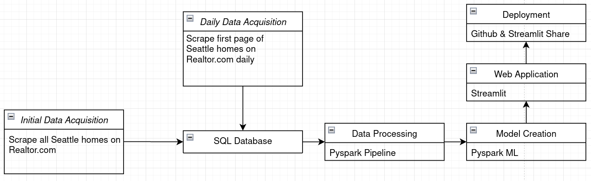
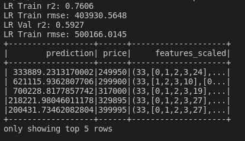

## Seattle House Price Prediction Application

Currently data is being stored in an SQL database and is being updated daily with new information from Realtor.com. Pyspark has been used to create a pipeline that will take in new data and transform it to be used in a linear regression machine learning algorithm. A streamlit app is in production to take the number of beds, baths, size of house, size of lot, and zip code as user input and return a predicted value of that home. 

Figure 1. Flow chart for project.

Figure 2. Linear regression model output.
